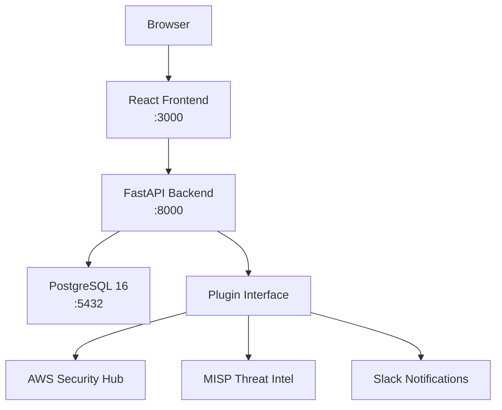

# 🏠 Lighthouse — GRC Platform

> A minimalist, opinionated GRC platform for small-to-mid SaaS companies — risk register, control framework mapping, TPRM, and evidence collection, all in one place.

**Status: MVP In Progress | Phase 1: Foundation | Target: August 2026**

---

## Features

### Core Modules
| Module | Description |
|---|---|
| **Risk Register** | Capture, score, treat, and review information security risks |
| **Control Framework** | Map controls to ISO 27001, NIST CSF, SOC 2, or custom YAML frameworks |
| **Policy Library** | Link Git-managed markdown policies to controls and risks |
| **TPRM** | Third-party risk assessments with inherent and residual scoring |
| **Evidence Collection** | Attach and track evidence artefacts to controls for audit readiness |
| **Audit Management** | Plan and track internal/external audits, findings, and remediation |
| **Dashboard** | Executive summary: risk posture, control health, open findings |

### Plugins
| Plugin | Description |
|---|---|
| **AWS Security Hub** | Pull findings from AWS Security Hub into the risk register |
| **MISP** | Ingest threat intelligence from a MISP instance |
| **Slack** | Post risk and audit notifications to Slack channels |

---

## Tech Stack

| Layer | Technology |
|---|---|
| **Backend** | Python 3.12 + FastAPI + SQLAlchemy 2.x (async) + Alembic |
| **Database** | PostgreSQL 16 |
| **Frontend** | React 18 + TypeScript + Vite + shadcn/ui + Tailwind CSS |
| **Auth** | FastAPI-Users (JWT) — Phase 2 |
| **Deploy** | Docker Compose (local demo) |
| **Testing** | pytest + pytest-asyncio (backend) + Playwright (e2e smoke) |
| **CI/CD** | GitHub Actions |

---

## Quick Start

### Prerequisites
- [Docker](https://docs.docker.com/get-docker/) and Docker Compose
- Git
- Node 20 (for local frontend development outside Docker)

### Steps

```bash
# 1. Clone the repository
git clone https://github.com/rahamawazo/lighthouse.git
cd lighthouse

# 2. Copy the environment file and review defaults
cp .env.example .env

# 3. Start all services
docker compose up

# 4. Run database migrations (first time only)
docker compose exec backend alembic upgrade head
```

| Service | URL |
|---|---|
| Frontend | http://localhost:3000 |
| API docs (Swagger) | http://localhost:8000/docs |
| API docs (ReDoc) | http://localhost:8000/redoc |
| API health check | http://localhost:8000/health |

---

## Project Structure

```
lighthouse/
├── .github/
│   └── workflows/
│       └── ci.yml              # GitHub Actions: backend tests + frontend build
├── backend/
│   ├── alembic/
│   │   ├── versions/
│   │   │   └── 0001_initial_risk_model.py
│   │   └── env.py
│   ├── app/
│   │   ├── models/
│   │   │   └── risk.py         # SQLAlchemy ORM models
│   │   ├── routers/
│   │   │   └── risks.py        # FastAPI route handlers
│   │   ├── schemas/
│   │   │   └── risk.py         # Pydantic request/response schemas
│   │   ├── config.py           # Pydantic-settings configuration
│   │   ├── database.py         # Async engine + session factory
│   │   └── main.py             # FastAPI application entry point
│   ├── alembic.ini
│   ├── Dockerfile
│   └── requirements.txt
├── docs/
│   └── adr/
│       └── ADR-001-platform-philosophy-and-scope.md
├── frontend/
│   ├── src/
│   │   ├── api/
│   │   │   └── risks.ts        # Axios API client
│   │   ├── components/
│   │   │   └── RiskTable.tsx   # Risk register table component
│   │   ├── pages/
│   │   │   └── RisksPage.tsx   # Risk register page
│   │   ├── App.tsx             # Root component + routing
│   │   ├── index.css           # Tailwind base styles
│   │   └── main.tsx            # React entry point
│   ├── Dockerfile
│   ├── index.html
│   ├── package.json
│   ├── tsconfig.json
│   └── vite.config.ts
├── .env.example
├── .gitignore
├── docker-compose.yml
└── README.md
```

---

## Architecture



---

## Deliverables Checklist

- [ ] GitHub repository (public, with this README)
- [ ] Live demo URL (Railway / Render deployment)
- [ ] Plugin SDK documentation (docs/plugin-sdk.md)
- [ ] Case-study PDF (lighthouse-case-study.pdf)
- [ ] Architecture Decision Records (docs/adr/)
- [ ] Blog post: "Building a GRC Platform as a Portfolio Project"

---

## License

MIT — see [LICENSE](LICENSE)
